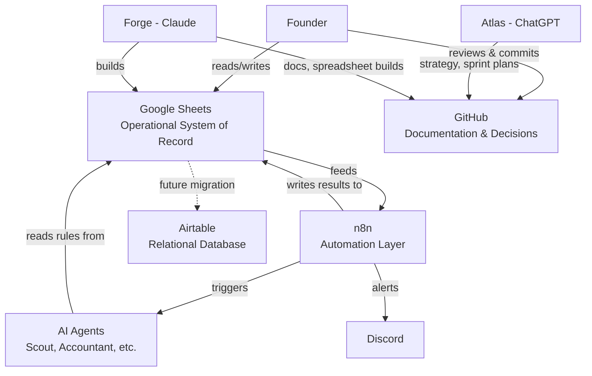

# Architecture — ArbitrageOS

## Philosophy

ArbitrageOS is deliberately **low-code first**. Every system below is
chosen so the Founder can operate it directly, with AI agents and
automations layered in only once the manual process is proven. Code (in
`/src` or equivalent) is the *last* resort, not the first.

## System Map

## Component Roles

### Google Sheets — Operational System of Record
Today, this is where the business actually runs: Dashboard, KPIs, Products,
Inventory, Purchases, Sales, Suppliers, Expenses, Daily Log, Scoreboard,
and the Decision Framework. See
[ADR-0002](../decisions/ADR-0002-Google-Sheets-Is-Operations.md) for why
this — and not Airtable or a custom database — is the system of record for
now.

### Airtable — Future Relational Layer
Reserved for Phase 2. As product/inventory/supplier relationships outgrow
what a flat spreadsheet can cleanly model (e.g. many-to-many
product-supplier links, structured automations firing on record changes),
Airtable becomes the operational database and Sheets is either retired or
demoted to a reporting view. This migration should be preceded by its own
ADR when it happens — it hasn't happened yet.

### n8n — Automation Orchestration
The connective tissue between the operational data and the AI agents.
Planned responsibilities: pulling product data from sourcing tools (Keepa,
SellerAmp SAS), running it against the Decision Framework criteria, writing
results back to the Products tab, and firing Discord alerts for
high-confidence opportunities. Not yet built as of this document's version.

### AI Agents ("AI Employees")
Narrow-scope AI processes, each with its own system prompt stored in
[`/prompts`](../prompts/README.md). The first is **Scout** — identifies
candidate products and scores them against the Decision Framework. Future
agents (Accountant, Inventory Manager, etc.) follow the same pattern: a
versioned prompt file, a defined input/output contract, and integration
via n8n where automation is warranted.

### GitHub — Documentation & Code
Canonical home for everything permanent: this documentation set, ADRs, AI
agent prompts, SOPs, and eventually source code for any custom automation
that outgrows n8n's low-code capabilities. See
[ADR-0001](../decisions/ADR-0001-GitHub-Is-Canonical.md).

### Dashboards
Currently the *Dashboard* tab inside the operating spreadsheet — a
live-formula view over the operational data. A standalone dashboard
(e.g. Airtable interface, or a small custom app) is a Phase 2/3
consideration, not a current requirement.

### Discord
Reserved for future automation alerts (e.g. "Scout found a product that
passes all 9 tests"). Not yet wired up.

## Data Flow (Current State, Sprint 1–5)

1. Founder discovers and validates candidates following the documented
   procedure in [`sops/SOP-001-Candidate-Discovery.md`](../sops/SOP-001-Candidate-Discovery.md)
   (retail-first discovery, SellerAmp scan, free-tier Keepa chart validation)
2. Founder enters product data into the **Products** tab
3. The 9-test Decision Framework (partly automatic — ROI/Profit
   calculated; partly manual — price stability, seasonality, etc.) produces
   a Framework Verdict of PASS-GO/FAIL-SKIP/Needs Review
4. Atlas scores qualifying candidates using the Capital Allocation
   Scorecard and issues an Atlas Recommendation (Buy/Wait/Reject)
5. Founder purchases only on a Buy recommendation, logging the purchase in
   **Purchases** and updating **Inventory**
6. Sales are logged in **Sales**, feeding **KPIs** and the **Dashboard**
   automatically via formula
7. **Scoreboard** is updated weekly; **Daily Log** is updated daily

## Data Flow (Target State, Phase 2)

Steps 1–3 above become partially automated: Scout ingests product
candidates, scores them against the Decision Framework criteria, and
writes qualifying candidates directly into the Products tab (or Airtable,
post-migration) for Founder review — collapsing manual research time
without removing the Founder's final decision authority.

## Extensibility Notes

- New AI agents should follow the existing prompt-file pattern in
  `/prompts` rather than being embedded ad hoc in automations
- New data relationships that don't fit a flat spreadsheet are a signal to
  revisit the Airtable migration, not to bolt more helper tabs onto Sheets
- Any component change that alters where a "fact" canonically lives
  (e.g., moving KPIs off Sheets) requires a new ADR before implementation
